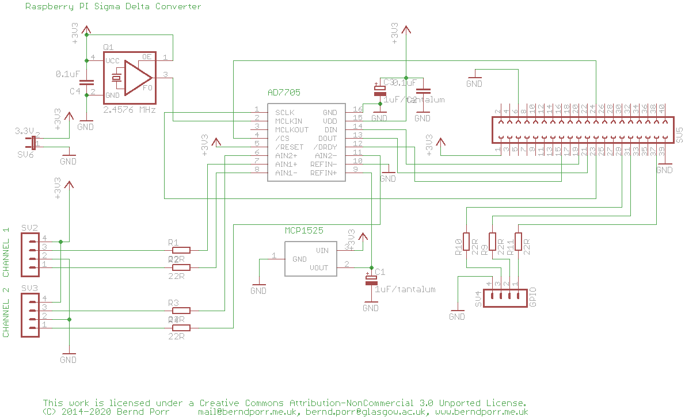

# Data acquisition with the AD7705 on the raspberry PI!

The AD7705 is a two channel sigma delta converter which has
differential inputs, a PGA and programmable data rates. It's
perfect for slowly changing inputs such as pressure, temperature,
heart rate etc.

This repo offers the class `AD7705Comm` which does all the low level
communications with the AD7705. The user just need to register a
callback handler which then returns the samples in realtime.

The class uses the DRDY of the AD7705 connected to Port 22 and
waits for a falling edge on this port to read
the data. This is done via interrupts / poll
so that the ADC process sleeps until new data becomes
available.

Further down I demonstrate how to use UDP to transmit the data to a web
page via PHP, JSON packets and client-side javascript!

## Hardware design

The design files (for EAGLE) are in the subdirectory "pcb".



## Building the demo / test:

To build:

    cmake .

    make

## Running

Run it with the command:

    ./ad7705_test

## General usage

### Callback handler

```
class AD7705printSampleCallback : public AD7705callback {
	virtual void hasSample(int v) {
		// process your sample here
		printf("v = %d\n",v);
	}
};
```

### Main program

Instantiate the AD7705 class and the callback handler:
```
	AD7705Comm ad7705comm;
	AD7705printSampleCallback ad7705printSampleCallback;
	ad7705comm.setCallback(&ad7705printSampleCallback);
```

Start the data acquisition:
```
	ad7705comm.start(AD7705Comm::SAMPLING_RATE_50HZ);
```
once `start` has been called the data will be arriving.

Stop the data acquisition:
```
	ad7705comm.stop();
```


## Website which shows realtime data using FastCGI

FastCGI is a concept where a webserver connects to an internal
fastcgi-server running on a certain port or socket which provides
the realtime data. Here, the fastCGI server is our AD7705
measurement program which continously measures the data from a
temperature sensor.

### FastCGI server

Start `ad7705fastcgi`
in the background with:
```
nohup ./ad7705fastcgi &
```
which creates a socket under `\tmp\adc7705socket` to communicate with
the fastcgi server.

### Configuring the nginx for FastCGI

 1. copy the the nginx config file `website/nginx-sites-enabled-default` to your
    nginx config directory `/etc/nginx/sites-enabled/default`.
 2. copy `website/index.html` to `/var/www/html`.
 
Then point your web-browser to your raspberry pi. You should see the current
temperatue reading on the screen.

The demo transmits only a single value but that can easily turned
into transmitting JSON packets for more complex data
and then decoded with jquery in the brower.


## UDP

### UDP transmitter

The program `udp_transmit` sends the raw ADC values as ASCII strings
with a carriage retun at the end to port 65000. This program can
run in the background. Start it with:

```
./udp_transmit &
```
to run in the background.

To stop it when running in the background look up its process ID with
`ps ax` and then send HUP with the kill command:

```
kill -HUP <pid>
```

### UDP test receiver

For debugging purposes there is a python script which prints
the UDP packets on the screen: `UDP_receive.py`.


## Author: Bernd Porr

bernd.porr@glasgow.ac.uk
mail@berndporr.me.uk
www.berndporr.me.uk
